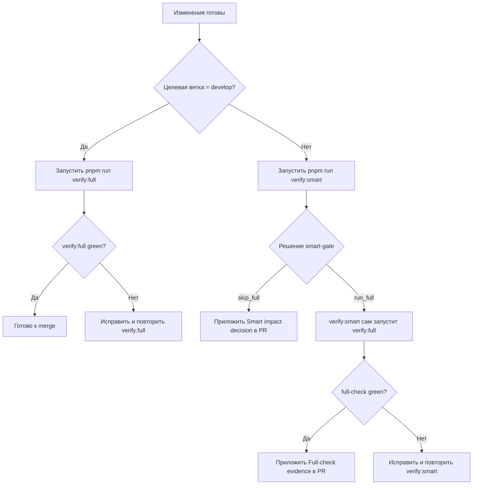

# Developer Check Sequence

Пошаговая последовательность для разработчика: что запускать при фичах, рефакторинге и merge в `develop`.

## Визуальная схема



## Общие правила

1. Для любой PR/feature-ветки обязательный запуск: `pnpm run verify:smart`.
2. Для `develop` обязательный запуск: `pnpm run verify:full`.
3. `verify:smart` всегда включает `ci:check`, потом сам решает `skip_full` или `run_full`.
4. Любая uncertainty в detector => `run_full` (fail-safe).
5. Для автоматического выбора команды можно использовать `pnpm run verify:auto`.
6. Рекомендуемый default процесс: git hooks (`pre-commit` + `pre-push`), чтобы проверки стартовали автоматически перед commit/push.

## Сценарии

### 1) Новая фича (по PR в feature-ветке)

1. `git fetch origin`
2. `pnpm run verify:smart`
3. Если в summary `decision=skip_full`, достаточно приложить `Smart impact decision`.
4. Если `decision=run_full`, `verify:smart` уже выполнит полный прогон; приложить `Full-check evidence`.

### 2) Рефакторинг или оптимизация

1. `git fetch origin`
2. `pnpm run verify:smart`
3. При влиянии на `locked`/infra/full uncertainty будет `run_full` автоматически.
4. Если изменения реально безопасные (например, чисто comments/docs), detector обычно даст `skip_full`.

### 3) Docs-only / comments-only

1. (Опционально для быстрой проверки) `VERIFY_SMART_BASE_REF=HEAD pnpm run detect:impact`
2. Обязательный шаг перед PR: `pnpm run verify:smart`
3. Ожидаемое поведение: `decision=skip_full` (если нет infra/protected impact).

### 4) Merge в develop (интеграционная ветка)

1. `pnpm run verify:full`
2. Убедиться, что green: `ci:check`, `test:e2e:smoke` (chromium + firefox + webkit), `perf:check` (Lighthouse budgets).

### 5) Аварийный ручной override

Если нужно принудительно прогнать full независимо от detector:

```bash
VERIFY_SMART_FORCE_FULL=1 pnpm run verify:smart
```

## Что приложить в PR

1. Секцию `Smart impact decision` (обязательно для PR/feature).
2. Секцию `Full-check evidence` (если решение было `run_full`).
3. Если менялся `locked` контракт: обновить `.ai/contracts/product-requirements-lock.json`, обновить `tests/contracts/**`, заполнить `Product contract impact`.

## Кто запускает

1. Разработчик запускает команды вручную локально или через ваш CI pipeline.
2. Агент запускает проверки только по явному запросу, не в фоне автоматически.
3. Если не хочется выбирать команду вручную, используйте `verify:auto` (с авто-решением по ветке/изменениям).
4. После `pnpm install` hooks ставятся через `prepare` автоматически; при необходимости можно вызвать `pnpm run hooks:install` вручную.
